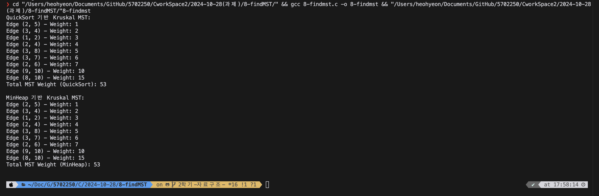

# Kruskal 알고리즘을 이용한 MST 찾기

## 개요
이 프로젝트는 Kruskal 알고리즘을 이용해 최소 신장 트리를 찾는 프로그램입니다. QuickSort 기반과 MinHeap 기반 두 가지 구현 방식을 사용했습니다.

## 실행 결과
아래는 프로그램 실행 결과의 캡처 화면입니다.

 

## 주요 함수
- `QuickKruskal`: QuickSort를 이용한 Kruskal 알고리즘 구현
- `MinHeapKruskal`: MinHeap을 이용한 Kruskal 알고리즘 구현

