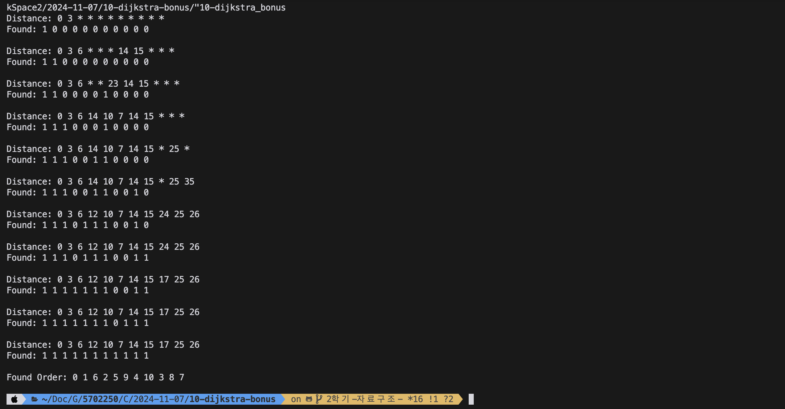
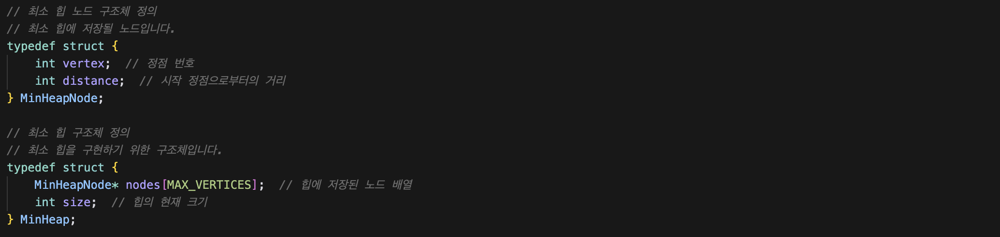
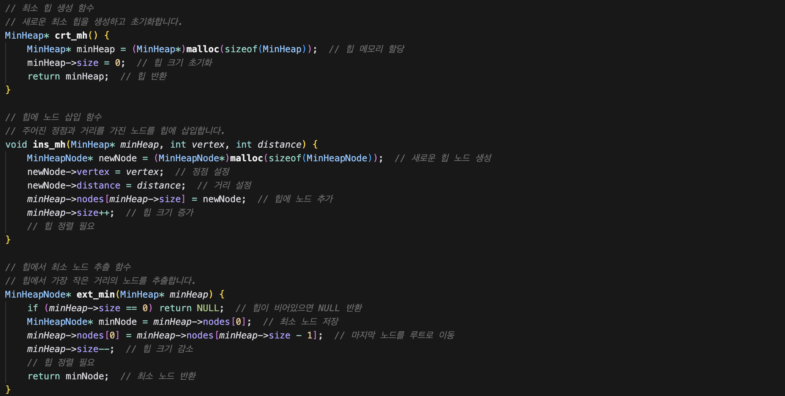
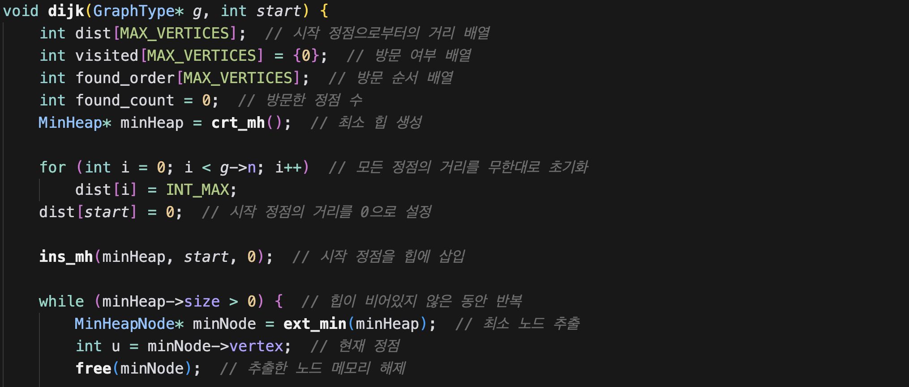
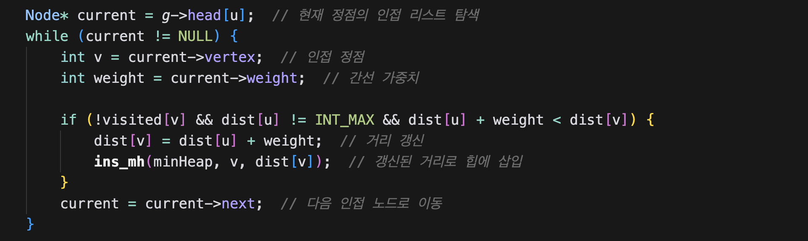

# Dijkstra's Algorithm Implementation

본 프로젝트는 Dijkstra 알고리즘을 이용하여 최단 경로를 찾는 프로그램입니다. 이 프로그램은 그래프에서 주어진 시작 노드로부터 다른 모든 노드로의 최단 경로를 계산하며, C언어로 작성되었습니다.

## 실행 방법
1. `10-dijkstra_bonus.c` 파일을 컴파일합니다.
2. 프로그램을 실행하여 최단 경로 결과를 확인합니다.

## 실행 결과 예시
아래는 프로그램을 실행한 결과 예시입니다:

## 주요 구현 내용
본 프로그램의 핵심은 최소 힙을 이용하여 효율적으로 최단 경로를 계산하는 부분입니다.

### 최소 힙 구현
다음은 최소 힙을 구현한 코드의 일부입니다.
아래 이미지는 최소 힙 구조체를 구현한 코드입니다.

아래 이미지는 최소 힙 함수를 구현한 코드입니다.

아래 이미지는 Dijkstra 알고리즘에서 최소 힙을 구현한 코드입니다.

## 파일 구조
- `10-dijkstra_bonus.c`: Dijkstra 알고리즘과 최소 힙을 구현한 C 언어 소스 파일입니다.
- `result-img.png`: 프로그램 실행 결과 캡처 이미지입니다.
- `struct-heap.png`: 최소 힙 구조체 구현 코드 캡처 이미지입니다.
- `min-heap.png`: 최소 힙 함수 구현 코드 캡처 이미지입니다.
- `dijk-heap1.png`: Dijkstra 알고리즘에서 최소 힙 구현 코드1 캡처 이미지입니다.
- `dijk-heap2.png`: Dijkstra 알고리즘에서 최소 힙 구현 코드2 캡처 이미지입니다.

## 사용 기술
- 언어: C
- 알고리즘: Dijkstra의 최단 경로 알고리즘
- 자료구조: 최소 힙 (Min-Heap)
