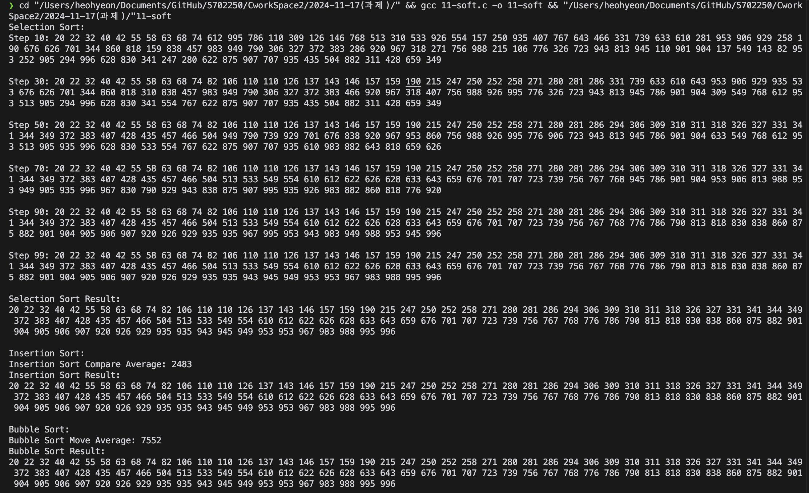

# Soft Sorting Algorithm

본 프로젝트는 선택,삽입,버블 정렬을 수행하는 프로그램입니다.
- 조건 1.선택 정렬 과정에서 정렬 과정을 10부터 20 단위 로 출력,그리고 마지막 번째를 출력하여 정렬을 확인합니다.
- 조건 2.삽입 정렬을 난수를 생성해 20회 시도하고 평균 비교 횟수를 출력합니다.
- 조건 3.버블 정렬을 난수를 생성해 20회 시도하고 평균 이동 횟수를 출력합니다. (과제에서 제시한 이동횟수 3회 구현.)
- 난수: 20회의 정렬 시도시 삽입 정렬 떄처럼 0~999 사이의 랜덤 데이터를 생성하되. 중복된 데이터는 허용하지 않습니다. 

## 실행 방법
1. `11-soft.c` 파일을 컴파일합니다.
2. 프로그램을 실행하여 최단 경로 결과를 확인합니다.

## 실행 결과 예시
아래는 프로그램을 실행한 결과 입니다:

## 주요 구현 내용
본 프로그램의 핵심은 선택,삽입,버블 정렬을 구현하는 부분입니다. 
또한 함수 호출시 난수의 시드를 고정하여 중복된 데이터를 허용하지 않게 해야합니다.