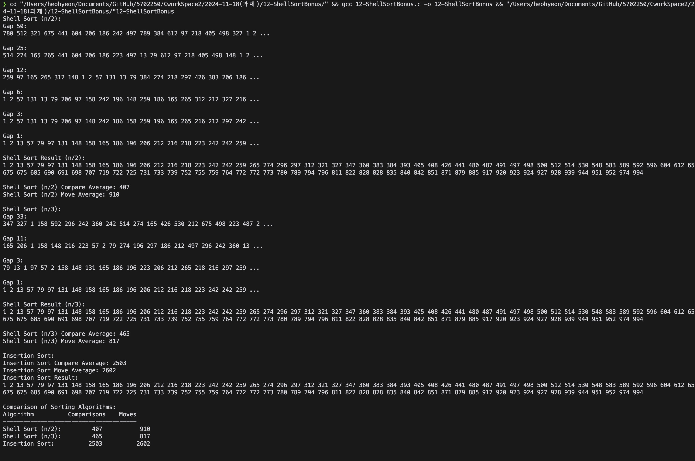

# Shell Sort & Insertion Sort Comparison

## 개요
이 프로그램은 **C 언어**로 작성된 정렬 알고리즘 비교 도구입니다. 
주어진 데이터 집합에 대해 **쉘 정렬(Shell Sort)**과 **삽입 정렬(Insertion Sort)**을 실행하고, 
각 알고리즘의 **비교 횟수**와 **이동 횟수**를 측정하여 성능을 분석합니다. 또한, 쉘 정렬의 간격 전략(gap factor)을 바탕으로 다양한 변형 결과를 제공합니다.

## 주요 기능
1. **난수 데이터 생성**:
   - 0에서 999까지의 정수 난수를 생성하여 배열에 저장합니다.
   - 동일한 실행 시에도 항상 새로운 난수를 생성합니다.

2. **쉘 정렬 (Shell Sort)**:
   - 간격 전략(gap factor)을 기반으로 점진적인 삽입 정렬 수행.
   - 간격(gap)을 `n/2`, `n/3` 등으로 조정하며 성능을 비교.

3. **삽입 정렬 (Insertion Sort)**:
   - 기본 삽입 정렬 알고리즘을 사용하여 배열을 정렬.
   - 비교 횟수와 이동 횟수를 계산.

4. **성능 분석**:
   - 정렬 실행 후 평균 비교 횟수와 이동 횟수를 출력.
   - 두 알고리즘의 성능을 테이블 형식으로 비교.

## 출력 형식
1. 정렬 과정에서 각 간격 단계(gap)별 중간 결과를 출력.
2. 쉘 정렬 및 삽입 정렬의 최종 정렬 결과 출력.
3. 알고리즘별 평균 비교 횟수와 이동 횟수를 표 형식으로 요약.

## 실행 결과 
아래는 프로그램을 실행한 결과 입니다:

## 기술적 특징
- **효율적인 메모리 관리**: `memcpy`를 사용하여 배열 복사.
- **랜덤 시드 설정**: `srand(time(NULL))`를 사용하여 매 실행마다 다른 난수를 생성.
- **성능 최적화**: 각 정렬 알고리즘이 효율적으로 수행되도록 설계.

