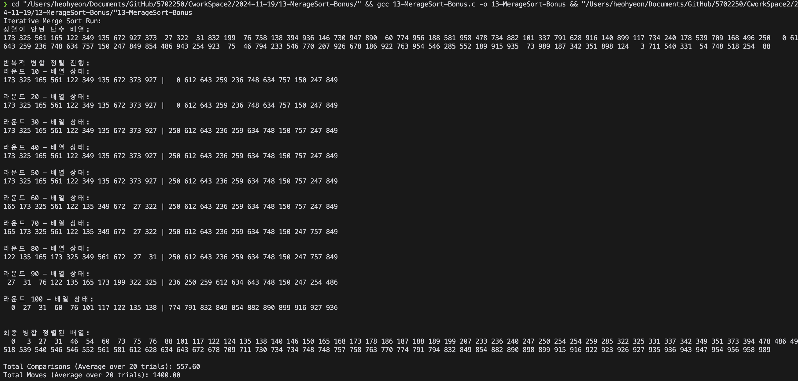

# 반복적 병합 정렬 (Iterative Merge Sort)

이 프로젝트는 반복적 병합 정렬(Iterative Merge Sort)을 구현한 C 언어 프로그램입니다. 정렬 과정에서 비교 횟수와 이동 횟수를 추적하며, 특정 단계에서 배열의 상태를 출력합니다. 평균 비교 및 이동 횟수를 여러 실험을 통해 분석할 수 있습니다.

---

## 📂 파일 설명

- **13-MerageSort-Bonus.c**  
  반복적 병합 정렬 알고리즘을 구현한 C 소스 코드입니다. 배열 생성, 병합 정렬, 그리고 성능 분석을 포함합니다.

---

## 📌 주요 기능

1. **랜덤 배열 생성**  
   - 0부터 999까지의 난수를 배열에 생성합니다.
   - 배열 크기는 `SIZE`(기본값: 100)로 정의됩니다.

2. **반복적 병합 정렬**  
   - 병합 과정에서 배열의 상태를 추적합니다.
   - 라운드 단위로 배열의 일부를 출력하여 진행 상황을 확인할 수 있습니다.

3. **비교 및 이동 횟수 계산**  
   - 병합 정렬 동안 발생하는 비교 및 이동 횟수를 기록합니다.
   - 여러 번 실행 후 평균값을 계산합니다.

4. **결과 출력**  
   - 정렬 전 배열, 정렬 과정(라운드), 정렬 후 배열을 출력합니다.
   - 테스트 반복 후 평균 비교 및 이동 횟수를 출력합니다.
   

---

## 💡 코드 구조

- `generateRandomNumber(int array[])`  
  난수 배열을 생성합니다.

- `merge(int array[], int left, int mid, int right, ...)`  
  두 배열을 병합합니다.

- `iterativeMergeSort(int array[], ...)`  
  반복적 병합 정렬을 수행합니다.

- `doIterativeMergeSort(int array[])`  
  여러 번의 정렬 테스트를 수행하고 결과를 분석합니다.

- `main()`  
  정렬 과정을 실행합니다.

---

## 📊 출력 예시

### 실행 후 출력 (첫 번째 테스트)
```plaintext
정렬이 안된 난수 배열:
124 542 32 765 ...

반복적 병합 정렬 진행:
라운드 10 - 배열 상태:
32 124 542 ...

최종 병합 정렬된 배열:
12 32 124 ...
