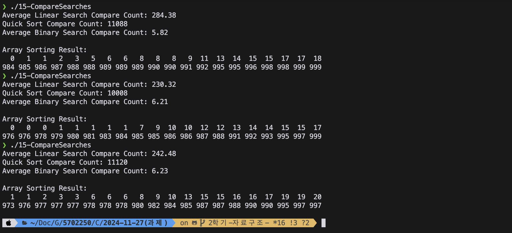

# 순차 탐색, 퀵 정렬, 이진 탐색 비교 실습 (15-CompareSearches)

## 1. 개요

이 프로그램은 세 가지 탐색 방법을 비교합니다:
1. **순차 탐색 (Linear Search)**: 정렬되지 않은 배열에서 목표 값을 탐색.
2. **퀵 정렬 (Quick Sort)**: 배열을 정렬하여 효율적인 탐색 준비.
3. **이진 탐색 (Binary Search)**: 정렬된 배열에서 목표 값을 탐색.

프로그램은 각 방법에 대한 비교 횟수를 계산하고 비교하여 이진 탐색이 왜 더 효율적인지 설명합니다.

---

## 2. 프로그램 실행 방법

1. 프로그램 실행 시 3가지 결과를 출력합니다:
   - 순차 탐색 100번 수행 후 평균 비교 횟수.
   - 퀵 정렬을 통해 배열 정렬 후 비교 횟수.
   - 정렬된 배열에 대해 이진 탐색 100번 수행 후 평균 비교 횟수.
   - 정렬된 배열의 처음 20개 값과 마지막 20개 값을 출력.

2. 출력 이미지:



3. `main` 함수는 터미널에서 3번 반복 실행하여 요구된 3회 출력 결과를 캡처합니다.

---

## 3. 코드 설명

### 3.1 주요 함수
- `generateRandomArray(int *array)`: 0부터 999까지의 랜덤 값을 배열에 채웁니다.
- `getAverageLinearSearchCompareCount(int *array)`: 순차 탐색을 100번 수행하고 평균 비교 횟수를 반환합니다.
- `getQuickSortCompareCount(int *array)`: 퀵 정렬을 수행하고 비교 횟수를 반환합니다.
- `getAverageBinarySearchCompareCount(int *array)`: 정렬된 배열에 대해 이진 탐색을 100번 수행하고 평균 비교 횟수를 반환합니다.
- `printArray(int *array)`: 정렬된 배열의 처음 20개와 마지막 20개 값을 출력합니다.

### 3.2 주요 논리
- **순차 탐색**: 배열의 각 요소를 차례로 비교하며 목표 값을 찾습니다. 비교 횟수는 배열 크기 및 목표 값의 위치에 따라 달라집니다.
- **퀵 정렬**: 배열을 정렬하기 위해 재귀적으로 분할하며, 각 분할 과정에서 비교 횟수를 누적합니다.
- **이진 탐색**: 정렬된 배열에서 중간값과 비교하여 탐색 범위를 줄이며 목표 값을 찾습니다.

---

## 4. 분석 및 결과
### 비교 횟수 간단 비교 표

| 탐색 방법       | 수행 횟수 | 평균 비교 횟수 (예시) | 시간 복잡도       |
|----------------|----------|---------------------|------------------|
| 순차 탐색      | 100회    | 약 263회            | \(O(n)\)         |
| 퀵 정렬        | 1회      | 약 10866회           | \(O(n \log n)\)  |
| 이진 탐색      | 100회    | 약 5~6회           | \(O(\log n)\)    |

---

### 요약
- **순차 탐색**은 배열의 크기에 비례하여 비교 횟수가 증가하므로 비교 횟수가 가장 많습니다.
- **퀵 정렬**은 초기 정렬 과정에서 비교 횟수가 많지만, 정렬된 배열은 이후 이진 탐색을 통해 효율적인 탐색이 가능합니다.
- **이진 탐색**은 탐색 범위를 절반씩 줄이기 때문에 비교 횟수가 매우 적습니다.
### 결론
퀵 정렬 후 이진 탐색은 초기 정렬 비용이 있지만, 탐색 과정에서 비교 횟수를 크게 줄여 효율적입니다. 반면, 순차 탐색은 탐색마다 비교 횟수가 많아 효율성이 낮습니다.
실제로 실행 결과에서, 이진 탐색은 평균 5~6회 비교로 가장 효율적임을 보여줍니다.

## 5.현재 구현 방식의 특징
- **target** 값이 배열에 존재하지 않을 가능성을 고려하여, 실제 환경에 가까운 탐색 시나리오를 구현합니다.
### target 설정과 탐색 방식
새로운 코드는 target 값의 설정 및 탐색 로직을 다음과 같이 처리합니다:
1. **임의의 숫자 생성**:
   - target 값을 `rand() % 1000`으로 생성하여 0~999 범위에서 난수를 선택합니다.
2. **탐색 가능 여부 확인**:
   - target 값이 배열 내에 존재하는지 `for` 루프를 통해 먼저 확인합니다.
3. **탐색 성공 시 처리**:
   - target 값이 배열에 존재하는 경우에만 탐색을 수행하고 비교 횟수를 누적합니다.

#### 구현 코드 (순차 탐색 예시)
```c
for (int i = 0; i < 100; i++) {
    int key = rand() % 1000;  // 0~999 사이의 난수
    int compareCount = 0;
    int found = 0;

    // 배열 내에 key 값이 존재하는지 확인
    for (int j = 0; j < SIZE; j++) {
        if (array[j] == key) {
            compareCount++;
            found = 1;
            break;
        }
    }

    // 존재하는 경우에만 탐색 비교 횟수 누적
    if (found) {
        for (int j = 0; j < SIZE; j++) {
            compareCount++;
            if (array[j] == key) {
                break;
            }
        }
        totalCompareCount += compareCount;
    }
}