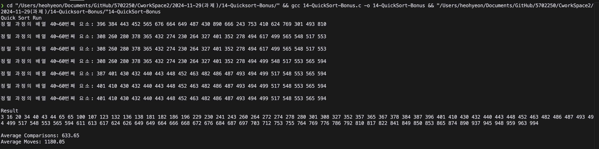

# QuickSort 성능 분석 프로그램

이 프로그램은 **반복적 QuickSort** 알고리즘을 사용하여 배열을 정렬하며, 성능 지표를 측정하고 분석합니다. 난수로 생성된 배열을 여러 번 정렬하여 평균 성능을 출력합니다.

---

## 💡 코드 구조

- `generateRandomArray(int array[])`  
  난수 배열을 생성합니다.

- `printArray(int array[], int size)`  
  배열의 모든 요소를 출력합니다.

- `printPartialArray(int array[])`  
  정렬 과정 중 배열의 40~60번째 요소를 출력합니다.

- `partition(int array[], int low, int high)`  
  배열을 피벗을 기준으로 두 부분으로 나누고 비교 및 이동 횟수를 기록합니다.

- `doQuickSort(int array[], int low, int high)`  
  반복적 QuickSort 알고리즘을 수행하며, 스택을 사용하여 반복적 구현을 시도했습니다.

- `main()`  
  여러 번의 정렬 테스트를 수행하고 평균 비교 및 이동 횟수를 출력합니다.

---  

3. **결과 확인**  
   


---

---

## 🔑 주요 기능

1. **반복적 QuickSort**:
   - 재귀를 사용하지 않고 스택 기반 구현으로 정렬을 수행합니다.

2. **성능 지표 추적**:
   - 정렬 중 비교와 이동 횟수를 카운트합니다.
   - 정렬 작업이 끝난 후 평균 비교 및 이동 횟수를 계산합니다.

3. **부분 배열 출력**:
   - 매 10번째 라운드마다 배열의 40~60번째 요소를 출력하여 정렬 과정을 확인할 수 있습니다.

4. **난수 배열 생성**:
   - 0~999 사이의 난수로 배열을 생성하여 테스트 데이터를 준비합니다.

---

## 📊 기존 정렬 알고리즘과 성능 비교

| 정렬 알고리즘  | 평균 시간 복잡도  | 최악 시간 복잡도   | 비교 횟수 평균 | 이동 횟수 평균 | 특징                                                                |
|----------------|------------------|-------------------|---------------|--------------|-------------------------------------------------------------------|
| 선택 정렬       | O(n²)           | O(n²)            | 높음          | 낮음          | 비교 횟수가 많지만 교환이 적음. 작은 데이터셋에 적합.               |
| 삽입 정렬       | O(n²)           | O(n²)            | 낮음          | 낮음          | 정렬된 데이터에 대해 효율적. 교환이 적음.                          |
| 버블 정렬       | O(n²)           | O(n²)            | 매우 높음     | 매우 높음     | 데이터 크기에 비례하여 비효율적이며 가장 느림.                     |
| 셸 정렬         | O(n log n)~O(n²)| O(n²)            | 낮음          | 낮음          | 간격 감소 방식으로 효율적으로 동작.                                |
| 합병 정렬       | O(n log n)      | O(n log n)       | 낮음          | 높음          | 안정적이며 항상 효율적이지만 추가 메모리가 필요함.                  |
| **QuickSort**   | **O(n log n)**  | **O(n²)**        | **중간**      | **중간**      | 평균적으로 가장 빠른 정렬. 스택 사용으로 메모리 최적화 가능.         |

---

## ✨ QuickSort의 장점과 단점

### 장점
- 평균 시간 복잡도가 **O(n log n)**으로 매우 빠릅니다.
- 추가 메모리 사용량이 적어 합병 정렬보다 효율적입니다.
- 반복적 구현으로 재귀 호출을 제거하여 스택 오버플로를 방지할 수 있습니다.

### 단점
- 피벗 선택이 잘못되면 최악의 경우 **O(n²)** 시간 복잡도가 발생할 수 있습니다.
- 정렬된 데이터의 경우 삽입 정렬이 더 효율적일 수 있습니다.

---

## ⚙️ 설정 변경

- **배열 크기 및 테스트 횟수**  
  아래 매크로를 수정해 배열 크기와 테스트 횟수를 조정할 수 있습니다:
  ```c
  #define SIZE 100       // 배열 크기
  #define TRIALS 20      // 테스트 반복 횟수