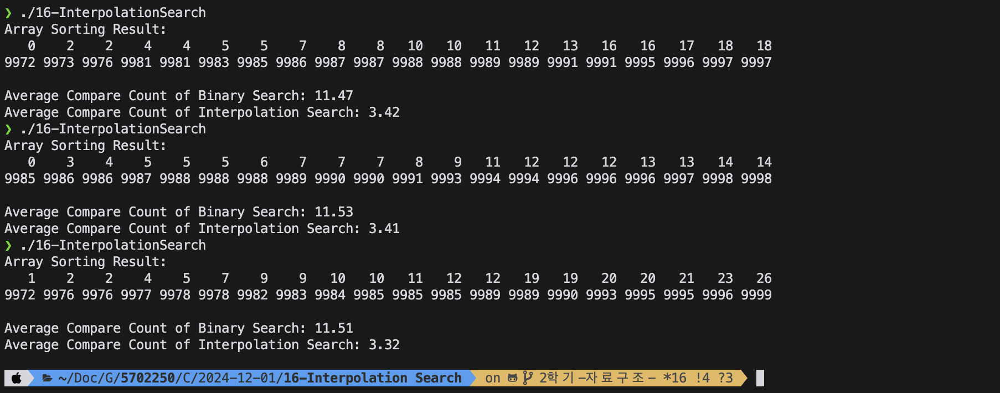

# 16-InterpolationSearch 과제

## 1. 개요

이 프로그램은 정렬 및 탐색 알고리즘의 성능을 비교하기 위해 작성되었습니다. 특히, 이진 탐색(Binary Search)과 보간 탐색(Interpolation Search)의 비교 횟수를 분석하여 보간 탐색이 왜 더 효율적인지를 설명합니다.

---

## 2. 프로그램 실행 방법과 결과.

1. 프로그램 실행 시 다음 결과가 출력됩니다:
   - 배열의 처음 20개 값과 마지막 20개 값.
   - 이진 탐색의 평균 비교 횟수.
   - 보간 탐색의 평균 비교 횟수.

2. 실행 시 주의사항:
   - `srand(time(NULL))` 함수로 랜덤 시드를 설정했으므로, 실행 간격이 1초 이상이어야 동일한 결과가 나오지 않습니다.
   - 동일한 출력을 위해 실행 결과 캡처본을 저장하여 제출합니다.

---

## 3. 코드 설명

### 퀵 정렬 최적화
이 프로그램에서는 일반적인 퀵 정렬을 최적화하기 위해 다음 두 가지 기법을 사용합니다:

#### 1. Median-of-Three 방식
- **Median-of-Three**는 배열의 처음, 중간, 마지막 요소 중 중앙값을 피벗으로 선택하는 방식입니다.
- 이는 퀵 정렬에서 흔히 발생하는 최악의 경우(피벗이 비균형적으로 선택되는 경우)를 줄여, 성능을 안정적으로 유지합니다.
- 피벗을 배열 중간값으로 설정하면, 배열이 균등하게 분할될 가능성이 높아집니다.

**예제 코드**:
```c
int medianOfThree(int *array, int low, int high) {
    int mid = low + (high - low) / 2;
    if (array[low] > array[mid]) {
        int temp = array[low];
        array[low] = array[mid];
        array[mid] = temp;
    }
    if (array[low] > array[high]) {
        int temp = array[low];
        array[low] = array[high];
        array[high] = temp;
    }
    if (array[mid] > array[high]) {
        int temp = array[mid];
        array[mid] = array[high];
        array[high] = temp;
    }
    return array[high];
}

---

## 3. 코드 설명

### 주요 함수
- `generateRandomArray(int *array)`: 0부터 9999까지의 랜덤 값을 생성하여 배열을 채웁니다.
- `QuickSort(int *array, int low, int high)`: Median-of-Three 방식을 사용해 배열을 정렬합니다.
- `binarySearch(int *array, int size, int key, int *compareCount)`: 정렬된 배열에서 키를 찾고 비교 횟수를 누적합니다.
- `interpolationSearch(int *array, int size, int key, int *compareCount)`: 정렬된 배열에서 보간 탐색 알고리즘을 사용해 키를 찾고 비교 횟수를 누적합니다.
- `printArray(int *array)`: 정렬된 배열의 처음 20개와 마지막 20개 값을 출력합니다.

---

## 4. 결과 분석

### 비교 횟수 간단 비교 표

| 탐색 방법       | 수행 횟수 | 평균 비교 횟수 (예시) | 시간 복잡도       |
|----------------|----------|---------------------|------------------|
| 이진 탐색      | 1000회   | 약 11회             | \(O(\log n)\)    |
| 보간 탐색      | 1000회   | 약 3~3.5회            | \(O(\log(\log n))\) |

### 보간 탐색이 이진 탐색보다 효율적인 이유
1. **배열의 균일성 활용**:
   - 보간 탐색은 배열 값이 균일하게 분포되어 있다고 가정하고, 값을 선형적으로 예측하여 탐색합니다.
   - 이진 탐색은 항상 중간값을 기준으로 탐색 범위를 나누는 데 반해, 보간 탐색은 목표 값의 상대적 위치를 예측하여 탐색 범위를 줄입니다.

2. **시간 복잡도**:
   - 이진 탐색의 시간 복잡도는 \(O(\log n)\)입니다.
   - 보간 탐색은 값이 균등하게 분포된 경우 \(O(\log(\log n))\)의 복잡도를 가지며, 더 빠른 탐색이 가능합니다.

---


