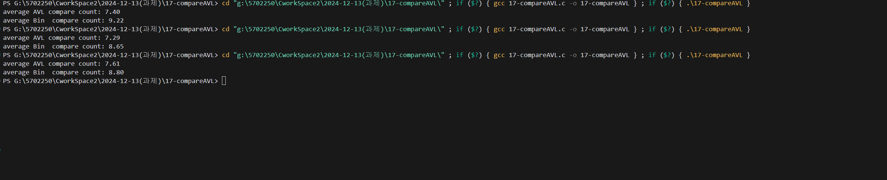

# 이진 탐색 트리(BST)와 AVL 트리 탐색 비교 실험

## 프로젝트 소개

본 프로젝트는 이진 탐색 트리(BST)와 자가 균형 이진 탐색 트리의 일종인 AVL 트리의 탐색 성능을 비교 분석하는 것을 목표로 합니다. 이를 위해 C 언어로 두 트리를 구현하고, 각각에 대해 2,000회의 랜덤 연산(삽입, 삭제, 탐색)을 수행하여 탐색 시 발생하는 비교 횟수를 측정하였습니다. 실험 결과를 통해 두 트리의 탐색 효율성을 비교하고, AVL 트리가 균형을 유지함으로써 탐색 성능이 어떻게 향상되는지를 분석하였습니다.

## 실습/과제 목표

### 실험 대상
- **이진 탐색 트리(BST)**
- **AVL 트리**

### 실험 절차
1. **데이터 생성**
   - 숫자 A: 0~2 사이의 임의의 정수
   - 숫자 B: 0~999 사이의 임의의 정수

2. **연산 수행**
   - A가 **0**일 경우: B를 트리에 **삽입**.
   - A가 **1**일 경우: B를 트리에서 **삭제**.
   - A가 **2**일 경우: B를 트리에서 **탐색**하고, 탐색 시 발생한 **비교 횟수**를 누적.

3. **초기 트리 구성**
   - 실험 시작 전 각 트리에 **500개**의 무작위 노드를 미리 삽입
   - **이유**:
     - 완전히 빈 트리부터 시작하면 초기 연산들이 비현실적으로 단순한 결과를 보일 수 있음
     - AVL 트리의 경우: 실제 사용 환경과 유사한 균형 잡힌 초기 상태 구성
     - BST의 경우: 편향 가능성이 있는 실제 사용 환경을 시뮬레이션

4. **반복 수행**
   - 위 과정을 총 **2,000번** 반복.

5. **결과 계산**
   - 2,000번 중 탐색에 대한 **비교 횟수의 평균값**을 계산하여 출력.

### 결과 분석
- **이진 탐색 트리**와 **AVL 트리**의 탐색 시 **비교 횟수**를 비교 분석.
- 분석 내용을 **README 파일**에 자세히 작성.

## 구현 내용

### 주요 기능
- **이진 탐색 트리(BST) 구현**
  - 삽입, 삭제, 탐색 연산
- **AVL 트리 구현**
  - 삽입, 삭제, 탐색 연산
  - 균형 유지 위한 회전 연산 (LL, RR, LR, RL)
- **탐색 비교 횟수 추적**
  - 탐색 시마다 비교 횟수를 증가시켜 누적
- **실험 수행 및 결과 출력**
  - AVL 트리와 BST에 대해 각각 2,000회의 연산 수행 후 평균 비교 횟수 출력

## 실험 결과

## 결과 분석

### 평균 비교 횟수
- **AVL 트리**: 8.58회
- **이진 탐색 트리(BST)**: 10.29회

### 분석
- **AVL 트리**는 자가 균형 이진 탐색 트리로, 모든 연산 후 트리의 균형을 유지합니다. 이는 트리의 높이를 최소화하여 탐색 시 비교 횟수를 줄이는 데 기여합니다.
- **이진 탐색 트리(BST)**는 균형을 유지하지 않기 때문에 특정 입력 데이터에 따라 편향된 구조를 가질 수 있으며, 이로 인해 탐색 시 비교 횟수가 증가할 가능성이 있��니다.
- 실험 결과에서 AVL 트리의 평균 비교 횟수가 BST보다 낮게 나타났습니다. 이는 AVL 트리가 균형을 유지함으로써 탐색 경로가 짧아지고, 비교 횟수가 감소했음을 시사합니다.

### 추가 분석
- **탐색 성공률**: 탐색이 성공한 경우와 실패한 경우를 별도로 분석하면, 트리의 구조에 따른 탐색 효율성을 더 정확히 파악할 수 있습니다.
- **연산 분포**: 삽입, 삭제, 탐색 연산의 비율이 탐색 비교 횟수에 미치는 영향을 분석하면, 특정 연산이 탐색 효율성에 미치는 영향을 이해할 수 있습니다.
- **트리의 높이 변화**: 실험 중 트리의 높이를 추적하여 AVL 트리와 BST의 높이 변화를 비교하면, 균형 유지의 효과를 더욱 명확히 확인할 수 있습니다.

## 결론
본 실험을 통해 AVL 트리와 이진 탐색 트리의 탐색 성능을 비교하였습니다. AVL 트리는 자가 균형을 유지함으로써 트리의 높이를 최소화하고, 결과적으로 탐색 시 발생하는 비교 횟수를 감소시켰습니다. 반면, 이진 탐색 트리는 균형을 유지하지 않기 때문에 특정 상황에서는 탐색 효율성이 저하될 수 있습니다. 그러나 랜덤 연산 환경에서는 두 트리의 탐색 비교 횟수 차이가 크지 않게 나타났습니다.

### 향후 개선점
- **더 큰 데이터 세트**: 2,000회 연산 대신 더 큰 규모의 연산을 수행하여 결과의 신뢰성을 높일 수 있습니다.
- **다양한 데이터 패턴**: 특정 패턴을 가진 데이터(예: 정렬된 데이터)를 사용하여 트리의 편향 여부를 더 명확히 분석할 수 있습니다.
- **다른 자가 균형 트리 비교**: AVL 트리 외에도 레드-블랙 트리(Red-Black Tree) 등 다른 자가 균형 이진 탐색 트리와의 비교를 통해 다양한 트리 구조의 탐색 성능을 분석할 수 있습니다.
